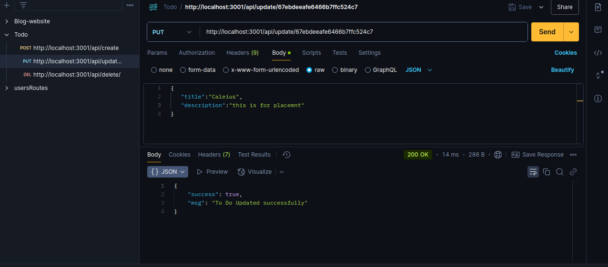
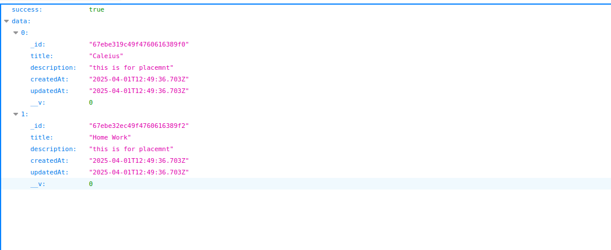

# Todo Backend

This is a simple Todo backend built using Node.js, Express, and MongoDB. It provides APIs to create, read, update, and delete todos.

## Features
- Add new tasks
- Retrieve all tasks
- Update existing tasks
- Delete tasks
- Mark tasks as completed

## Technologies Used
- Node.js
- Express.js
- MongoDB
- Mongoose

## Installation

1. Clone the repository:
   ```sh
   git clone https://github.com/your-username/todo-backend.git
   cd todo-backend
   ```

2. Install dependencies:
   ```sh
   npm install
   ```

3. Set up environment variables:
   Create a `.env` file in the root directory and add the following:
   ```env
   PORT=5000
   MONGO_URI=your_mongodb_connection_string
   ```

4. Start the server:
   ```sh
   npm start
   ```
   The server will run on `http://localhost:5000`

## API Endpoints

| Method | Endpoint        | Description              |
|--------|----------------|--------------------------|
| GET    | /api/     | Get all todos           |
| POST   | /api/create    | Create a new todo       |
| PUT    | /api/update/:id | Update an existing todo |
| DELETE | /api/delete/:id | Delete a todo           |

## Screenshot
Add a screenshot of your project by placing an image inside the repository and referencing it in the README.

Example:
```md


```

## License
This project is licensed under the MIT License.

## Author
- **Sourabh Kumar**

